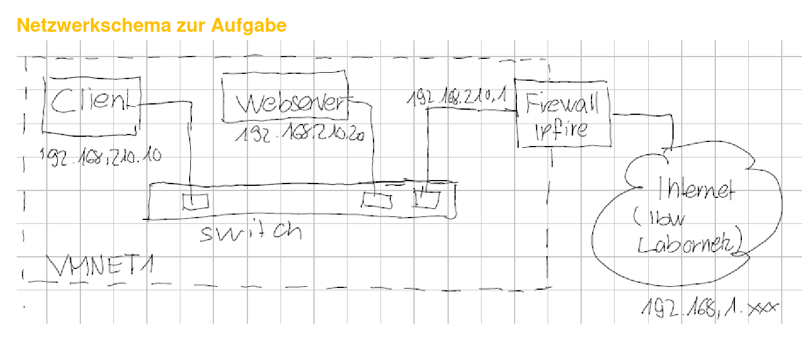
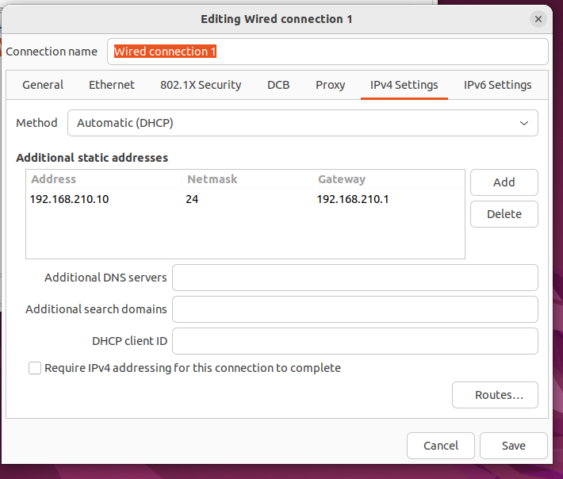
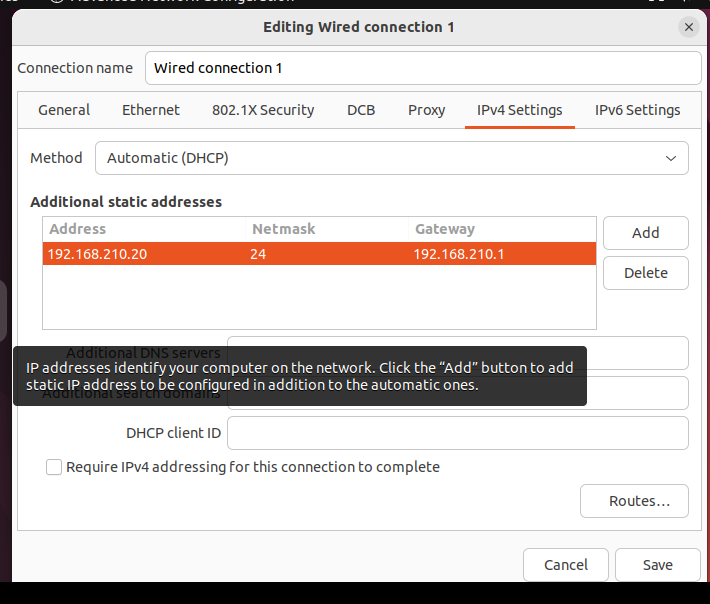
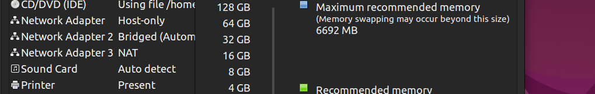

# Network
This is a short documentation to show how to set up this network used in the course. It shows the mayor pitfalls and how to avoid them. You still will have problems setting up this network.

## Setup 
To setup this network we need three virtual machines.  

1. Ubuntu Client
2. Ubuntu Webserver
3. IP Fire

## Connect to Class WLAN
We need to connect to the class WLan for this all to work
SSID: ibw_202
Password: 12345678#

## Network Overview

## Setup the Ubuntu Client
First install the ubuntu client on the virtual machine.

### Network Setup Ubuntu Client
Switch the network adapter to **Host Only**. And make sure it has a MAC address.

Go to the ubuntu Network settings in the IPv4 settings to the following:  

### Deactivate Ubuntu Firewall
sudo ufw disable
sudo reboot now

## Setup the Ubuntu Server
First install a other Ubuntu virtual machine instance

### Network Setup Ubuntu Server
Switch the network adapter to **Host Only**. And make sure it has a MAC address.

Go to the ubuntu Network settings in the IPv4 settings to the following:  

### Setup the Apache Server
I did this last weak and it works to lazy to write it down for the moment.

### Start the Apache Web Server  
Switch to the: /opt/lampp folder.
And run: sudo ./manager-linux-x64.run 

### Deactivate Ubuntu Firewall
sudo ufw disable
sudo reboot now

## IPfire

### Installation VM
Download the most update ISO and install it as a new Virtual machine instance. Make Sure to select the **Linux Kernel 5.0.4** to install.

Make sure to remember the set password.  
The default login for the IPFire console is **root**
For the website it will be **admin**

### IP Fire Setup
Enter **not documented** to enter the setup.

Also the entire setup is not document works for me will document it as soon as i have it to do it again. Also update the Network overview picture whit the colors would help a lot. 

### Network Setup IPFire
For this VM we need 3 network adapters add them. And make sure they all of a MAC address.

## Random interruption's from the teacher
- Something about permit root login yes and reboot